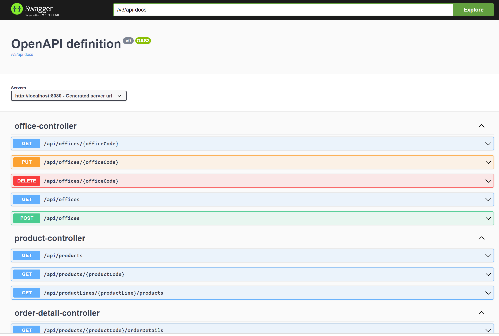
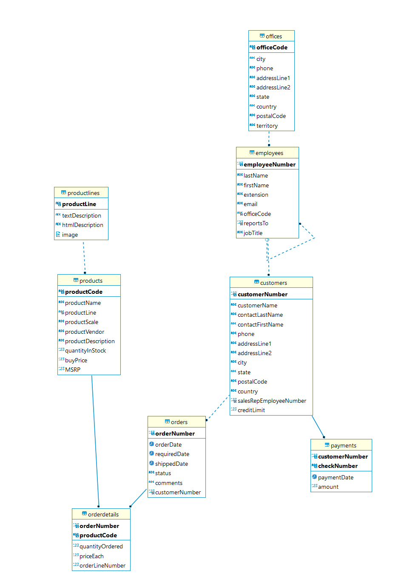

# spring2

## What it is
This is a simple Webservice Backend for the [MySQL Sample Database](https://www.mysqltutorial.org/mysql-sample-database.aspx).

It can be used by any webservice-enabled frontend. Also it has a built-in [Swagger](https://swagger.io/) GUI.

### Tooling
This Webservice uses:
* [Java 17](https://www.oracle.com/java/technologies/javase/jdk17-archive-downloads.html)
* [Spring Boot](https://spring.io/projects/spring-boot)
* [Gradle](https://gradle.org/)
* [Lombok](https://projectlombok.org/) 
* [Swagger](https://swagger.io/)
* [MySQL](https://www.mysql.com/de/)

## How to install

### Database

* [Install MySQL](https://www.mysqltutorial.org/install-mysql/)
* Download and install the [Sample Database](https://www.mysqltutorial.org/mysql-sample-database.aspx)
* You could test the Database Installation with [dBeaver](https://dbeaver.io/).

### Webservice
* Install [Java JRE 17](https://www.oracle.com/java/technologies/javase/jdk17-archive-downloads.html) (or newer).
* Download the artifact "Libs" from this GitHub project, and unzip the artifact.

## How to run the Webservice
* Open a command prompt
* Verify your Java installation with "java --version". It should be version 17.
* Switch to the directory where you unzipped the "Libs"-Artifact.
* Start the Webservice with "java -jar demo-0.0.1-SNAPSHOT.jar". It should show the "Spring"-Logo on startup.
* The Swagger GUI is available at http://localhost:8080/swagger-ui/index.html.

## Todos
* Clean up code
* Write Tests
* Logging
* Docker
* Host it on Azure
* ...

## Pictures

