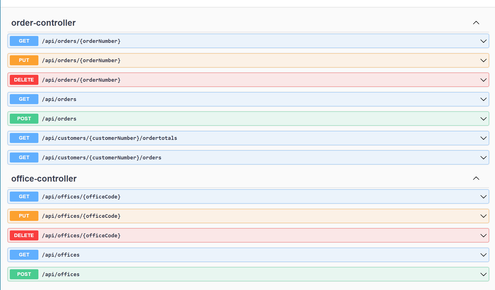

# classic_models_backend_spring

## What it is
This is a simple webservice backend for the [MySQL sample database](https://www.mysqltutorial.org/mysql-sample-database.aspx) "classicmodels".

It can be used by any webservice-enabled frontend. It also has a built-in [Swagger](https://swagger.io/) GUI.
You can find my Vue.js frontend at "classic_models_frontend_vue".

### Tooling
This Webservice uses:
* [Java 17](https://www.oracle.com/java/technologies/javase/jdk17-archive-downloads.html)
* [Spring Boot](https://spring.io/projects/spring-boot)
* [Gradle](https://gradle.org/)
* [Lombok](https://projectlombok.org/) 
* [Swagger](https://swagger.io/)
* [MySQL](https://www.mysql.com/de/)

## How to install

### Database

* [Install MySQL](https://www.mysqltutorial.org/install-mysql/)
* Download and install the [sample database](https://www.mysqltutorial.org/mysql-sample-database.aspx)
* You can test the database installation with [dBeaver](https://dbeaver.io/).

### Web Service
* Install [Java JRE 17](https://www.oracle.com/java/technologies/javase/jdk17-archive-downloads.html) (or newer).
* Download the artifact "libs" from this GitHub project, and unzip it.

## How to run the web service
* Open a command prompt
* Check your Java installation with "java --version". It should be version 17.
* Change to the directory where you unzipped the libs artifact.
* Start the web service with "java -jar demo-0.0.1-SNAPSHOT.jar". It should display the Spring logo on startup.
* The Swagger GUI is available from http://localhost:8080/swagger-ui/index.html.
* You can build an executable jar file with "./gradlew bootJar".

## News
* Order Entry implemented
* Customer Queries implemented
* [Readme for AWS Deployment](./doc/HowtoPublishOnAWS.md)

## To Do
* Clean up code
* Remove duplicate code 
* Write tests
* CRUD implemented only for offices, orders and orderdetails
* Validation is implemented for "office" table only
* Logging
* Docker
* Hosting on AWS
* Globalization of error messages
* ...

## Pictures

### Swagger GUI

### MySQL sample database

